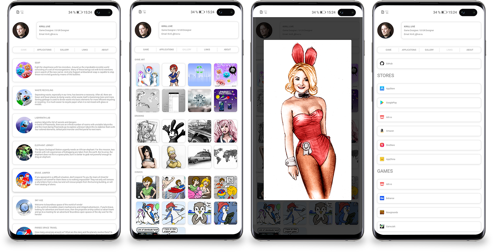

# I CAN DO

Simple HTML page for portfolio, personal content or catalog. the content is set using a json file, which is analyzed using javascript and displays the content in several ways (gallery, list, text). There is a built-in image viewer, HTML content and links to external pages. the number of pages and directories is not limited 

To use it is not necessary to know the languages and programming, it is easy to use and is suitable as a homepage for content makers, artists, bloggers and many others.
You can use a business card as a site or directories of links to social networks and other sites

Key Features:
- No using JQuery
- Easy to use and upgrades (possibly modify css, html, and javascript)
- Integrated image viewer
- Content is stored in json
- Displays html content from json, you can put an iframe or video from YouTube
- 3 views for presenting content (gallery, list, text)

Example
http://odin-interactive.com/kirill.html
